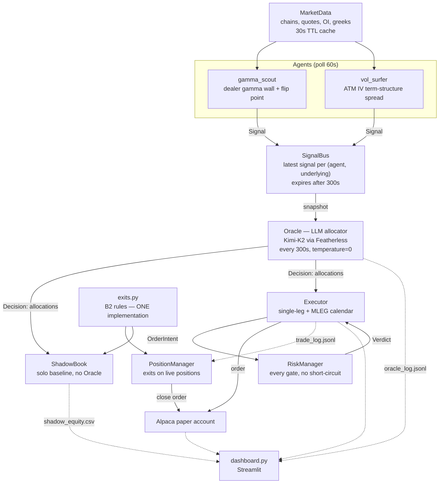

# Quantamental Options Swarm

Two specialist options agents publish signals to a shared bus. An LLM **Oracle** decides
how much capital each signal gets. Every resulting order passes a set of risk gates before
it reaches Alpaca. A **shadow book** records what each agent would have done trading alone,
so the Oracle's contribution can be measured rather than asserted.

Built on Alpaca paper trading (options level 3) with live option chains.

---

## Architecture



### The pieces

| Module | Responsibility |
|---|---|
| `swarm/agents/gamma_scout.py` | Locates the dominant dealer gamma strike (the "wall") and the gamma flip point via a spot-grid scan. Fires only while spot is within 1% of the wall. |
| `swarm/agents/vol_surfer.py` | Measures the ATM implied-vol spread between a ~14 DTE and a ~70 DTE expiration and flags dislocations against its own recent range. Direction-neutral. |
| `swarm/bus.py` | Latest signal per `(agent, underlying)`, **expiring after 300s** so silence from an agent reads as "no signal", not "the previous signal". |
| `swarm/oracle.py` | Allocates capital across signals. Logs every decision, including fallbacks. |
| `swarm/risk.py` | Owns the order types *and* the gates, so an order cannot be constructed without importing the thing that checks it. |
| `swarm/execution.py` | Builds intents, submits single-leg and multi-leg (MLEG) orders, manages exits on live positions. |
| `swarm/exits.py` | The B2 exit rules, in one place, shared by the live and shadow books. |
| `swarm/shadow.py` | The no-Oracle baseline: opens a position for *every* signal, at a fixed size. |
| `dashboard.py` | Read-only Streamlit view over the logs and the account. |

### Design decisions worth naming

**Risk was written before the executor.** The order dataclasses (`Leg`, `OrderIntent`) live
in `risk.py`. There is no code path that builds an order without importing the gates.

**`check()` evaluates every gate rather than stopping at the first failure.** A rejected
order carries the complete reason it was rejected, which is what the dashboard shows.

**One exit implementation, not two.** If the shadow book and the live position manager had
separate copies of the B2 rules, the swarm-vs-solo curve would eventually be measuring the
drift between them instead of the Oracle.

**The shadow book uses the executor's own intent builder.** Both books therefore pick
identical contracts, so the comparison isolates allocation rather than strike selection.

**The allocation is a ceiling, not a target.** `RiskManager.size()` takes
`min(alloc, max_per_trade)` — risk narrows the Oracle's number, never widens it.

**The LLM is off the critical path.** Every blocking HTTP call — Alpaca and Featherless —
is wrapped in `asyncio.to_thread`. If the Oracle fails, the swarm holds its last good
allocation and keeps running.

---

## Setup

Requires Python 3.14 and an Alpaca paper account with **options level 3**.

```bash
python -m venv .venv
.venv/Scripts/pip install -r requirements.txt      # Windows
cp .env.example .env                               # then fill in the keys
```

`.env`:

```
ALPACA_API_KEY=...
ALPACA_SECRET_KEY=...
ALPACA_PAPER_TRADE=true
FEATHERLESS_API_KEY=...
```

## Running

```bash
# dry run: agents, Oracle and every risk gate execute, but no order is sent
python main.py --tag dev

# live on the paper account
python main.py --live --tag dev

# a second account, with its own artifacts
python main.py --live --env-file .env.submission --tag submission

# the dashboard
streamlit run dashboard.py
```

| Flag | Default | Purpose |
|---|---|---|
| `--live` | off | Actually submit. Without it the gates still run and rejections are still real. |
| `--env-file` | `.env` | Which account's credentials to use. |
| `--tag` | `dev` | Artifact subdirectory under `results/`. **One per account** — `PositionManager` rehydrates open positions from the trade log, so a shared log would have one account trying to close the other's positions. |
| `--sample-every-s` | `900` | History sampling cadence. Use `120` for a faster demo warm-up. |
| `--oracle-interval-s` | `300` | How often the Oracle re-allocates. |

> **Warm-up.** History is sampled every 15 minutes, so `vol_surfer`'s 5-observation
> minimum takes ~75 minutes from cold and a full 30-observation window takes 7.5 hours.
> Leave the swarm running. The history CSVs are deliberately shared across runs and are
> *not* reset by `--tag`.

## Artifacts

Written to `results/<tag>/`:

| File | Contents |
|---|---|
| `oracle_log.jsonl` | Every decision: the input signals, the raw model output, the sanitized allocation, the acted-on allocation, latency, and whether it was a fallback. The explainability record. |
| `trade_log.jsonl` | Every order attempt, with the full list of gates it failed. |
| `shadow_book.json` | The solo baseline's positions and exits. |
| `shadow_equity.csv` | The solo equity curve. |

`gex_history.csv` and `volspread_history.csv` live at the repo root and are shared by all
runs — they are the agents' view of the market, not of an account.

## Tests

```bash
python -m pytest tests/ -q
```

## Known limitations

See `WRITEUP.md`.
